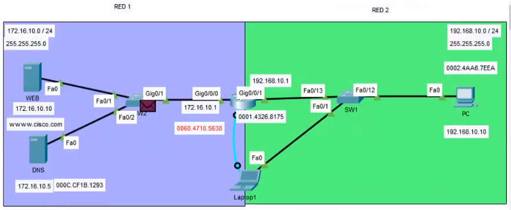
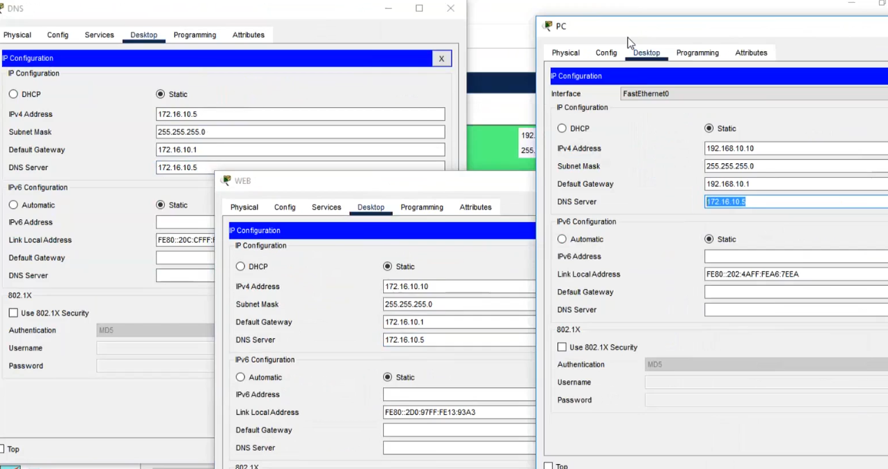
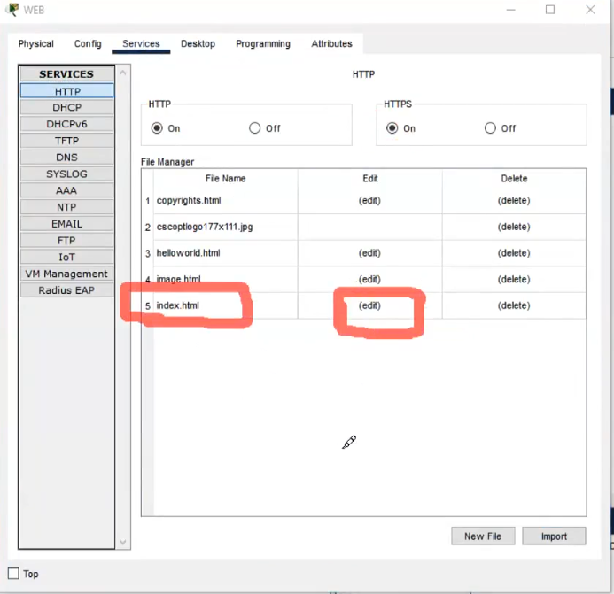
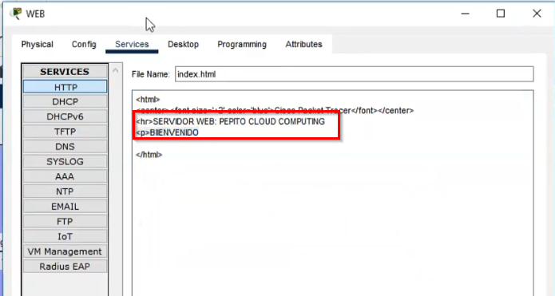
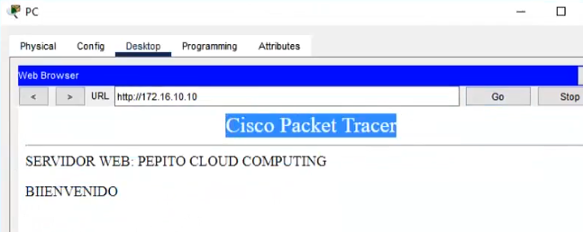
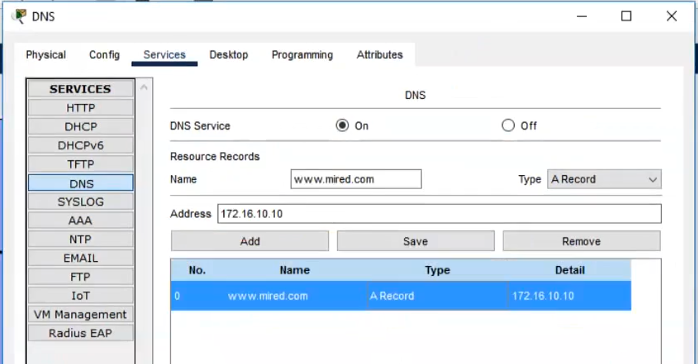

## Servicio WEB | SSH | DNS | TELNET

    R1
    enable
    configure terminal
    no ip domain-lookup
    hostname R1
    interface g0/0/1
    ip address 192.168.10.1  255.255.255.0
    description RED-2
    no shutdown
    interface g0/0/0
    ip address 172.16.10.1 255.255.255.0
    description RED-1
    no shutdown
    exit

    #ping
    #show running-config
    #show ip interface brief
---
    TELNET
    SSH
    WEB
    DNS
---
    TELNET

    R1
    enable
    configure terminal
    line vty 0 4
    password cisco
    login
    exit

----------------------------
    SSH
    enable
    configure terminal
    ip domain-name mired.com
    crypto key generate rsa general-key modulus 2000
    username cisco privilege 15 secret cisco
    username edison privilige 15 secret edison
    no enable secret cisco
    enable password cisco

    banner motd $ Unicamente solo poersonal autoizado $
    line console 0
    login local
    exec-timeout 0
    exit
    line vty 0 4
    login local
    exec-timeout 0
    !transport input all
    exit
    !service password-encryption
---    
    PC
    ssh -l cisco 192.168.10.1
---
### Configuración fisíca
#### Server Web

#### Server DNS
