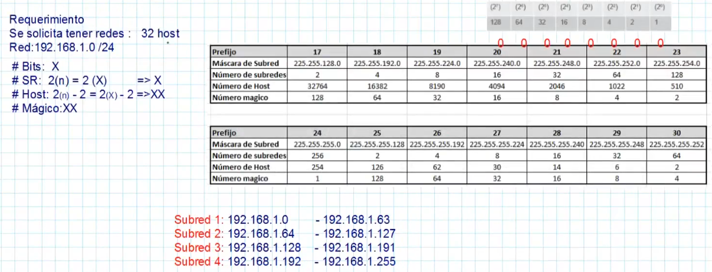
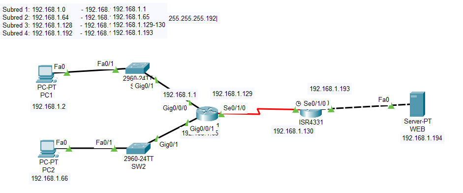
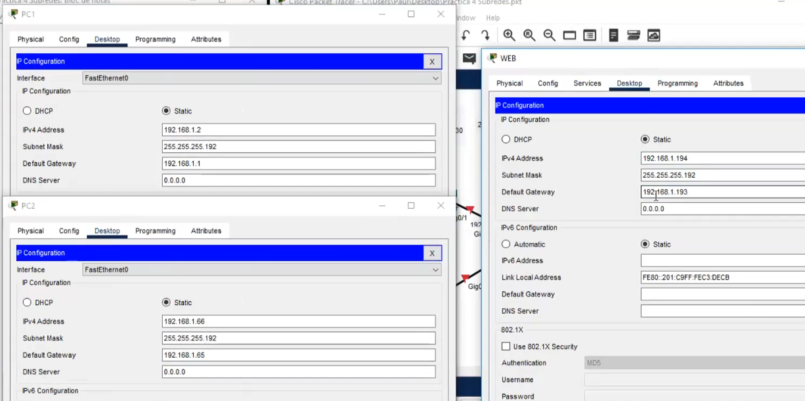

## Configuración Subredes

### Tabla de subneteo y ejemplo

### Configuración de Equipos

    R1
    enable
    configure terminal
    no ip domain-lookup
    hostname R1
    interface g0/0/0
    ip address 192.168.1.1  255.255.255.192
    no shutdown
    interface g0/0/1
    ip address 192.168.1.65 255.255.255.192
    no shutdown
    interface serial0/1/0
    ip address 192.168.1.129 255.255.255.192
    no shutdown
    #show ip interface brief
    #show running-config
---
    R2
    enable
    configure terminal
    no ip domain-lookup
    hostname R2
    interface g0/0/0
    ip address 192.168.1.193 255.255.255.192
    no shutdown
    interface serial0/1/0
    ip address 192.168.1.130 255.255.255.192
    no shutdown
---
    R1-R2
    router eigrp 1
    network 0.0.0.0
    exit

