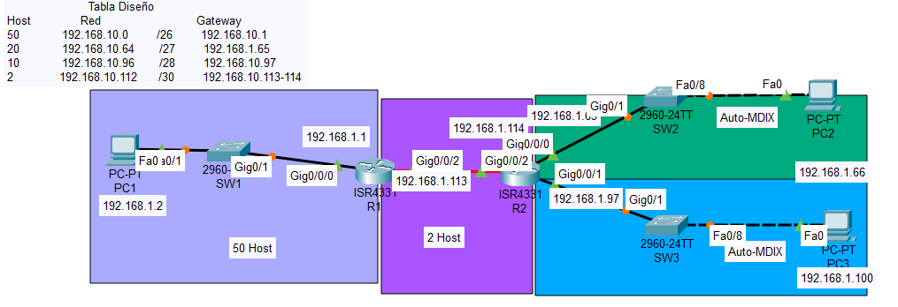

## Configuración VSLM
                    Tabla Diseño
| Host | Red | Máscara | Gateway |
| --------- | -------- | --------- | -------- |
|50|            192.168.10.0 |       /26   |     192.168.10.1|
|20    |        192.168.10.64   |    /27|        192.168.1.65|
|10      |      192.168.10.96  |     /28 |       192.168.10.97|
|2         |    192.168.10.112|      /30  |      192.168.10.113-114|

    R1
    enable
    configure terminal
    no ip domain-lookup
    hostname R1
    interface g0/0/0
    ip address  192.168.1.1 255.255.255.192
    no shutdown
    interface g0/0/2
    ip address 192.168.1.113 255.255.255.252
    no shutdown
    exit
---
    R2
    enable
    configure terminal
    no ip domain-lookup
    hostname R2
    interface g0/0/0
    ip address 192.168.1.65 255.255.255.224
    no shutdown
    interface g0/0/1
    ip address 192.168.1.97 255.255.255.240
    no shutdown
    interface g0/0/2
    ip address 192.168.1.114 255.255.255.252
    no shutdown
---
    R1-R2
    router ospf 1
    network 0.0.0.0 255.255.255.255 area 0
    exit
