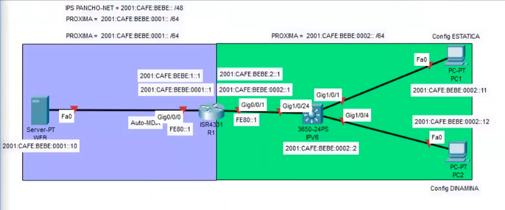
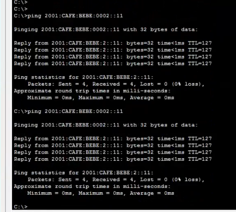
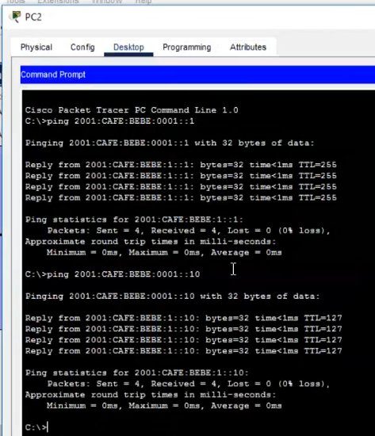
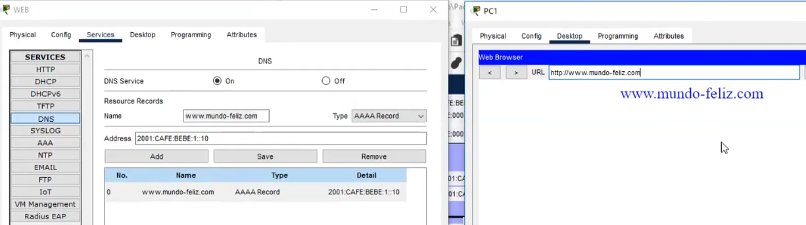
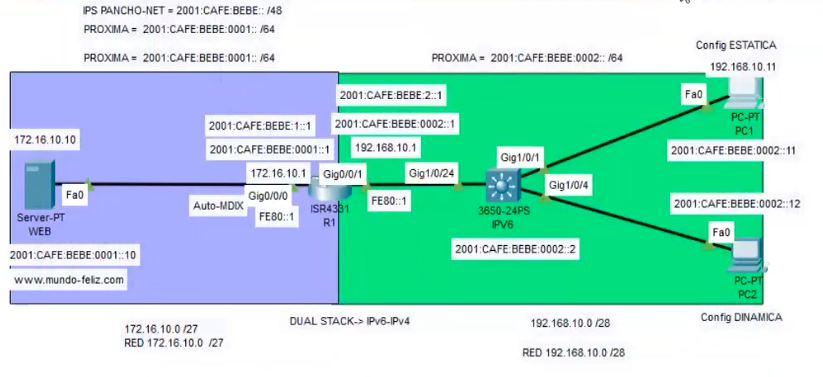
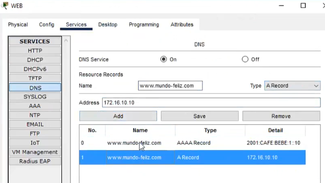

## Configuración IPv6

    R1
    enable
    conf t
    hostname R1
    no ip domain-lookup
    ipv6 unicast-routing
    int g0/0/0
    ipv6 address 2001:cafe:bebe:0001::1/64
    !ipv6 address fe80::1 link-local
    no shut down
    exit
    int g0/0/1
    ipv6 address 2001:cafe:bebe:0002::1/64
    !ipv6 address fe80::1 link-local
    no shutdown
    line vty 0 4
    password cisco
    login
    exit

    #show run
    #show ipv6 int brief
    #show ipv6 route
    #show int g0/0/0
---
    SW1
    enable
    conf t
    hostname SW1
    no ip domain-lookup
    !ipv6 unicast-routing
    int vlan 1
    ipv6 address 2001:cafe:bebe:0002::2/64
    ipv6 address fe80::2 link-local
    no shutdown
    exit
    line vty 0 4
    password cisco
    login
    exit
---
    SERVER:
    ping 2001:cafe:bebe:0001::1
    ping 2001:cafe:bebe:0001::10
### Pruebas de conectividad

### DNS

## Configuración de IPv4
### Subneteo
    192.168.10.0 /28
    Mask= 255.255.255.240
    Host= 14
    SR= 16
    NM= 16
    192.168.10.0
    192.168.10.16
    192.168.10.32
    ...
    192.168.10.240

---
    R1
    int g0/0/1
    ip add 192.168.10.1 255.255.255.240
    exit
### Servicio con web con IPv4

