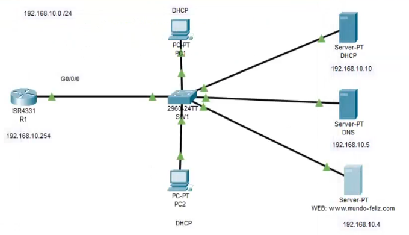
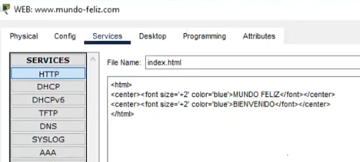
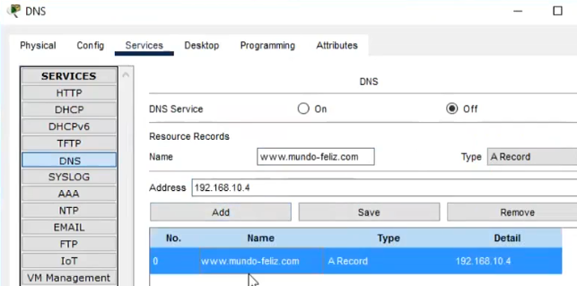
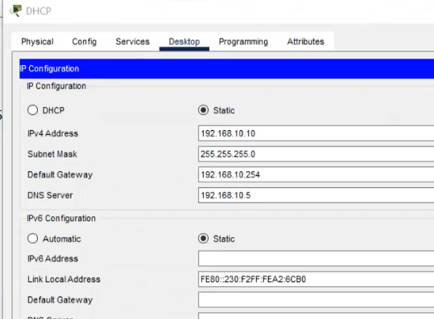
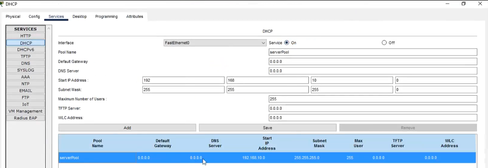
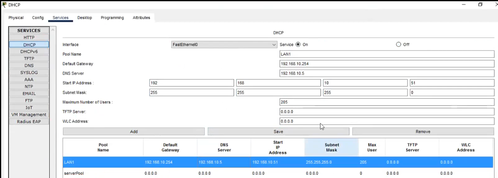
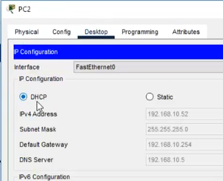

## Configuración DNS | WEB | DHCP

    R1
    ena
    conf t
    hostname R1
    int g/0/0
    ip add 192.168.10.254 255.255.255.0
    no shutdown
    #show ip interface brief
    #nslookup
---
    SW1
    int vlan 1
    ip add dhcp
    no shutdown
    exit
---
### Configuración WEB

### Configuración DNS

### Configuración DHCP

### Agregando automaticamente al os host su ip
