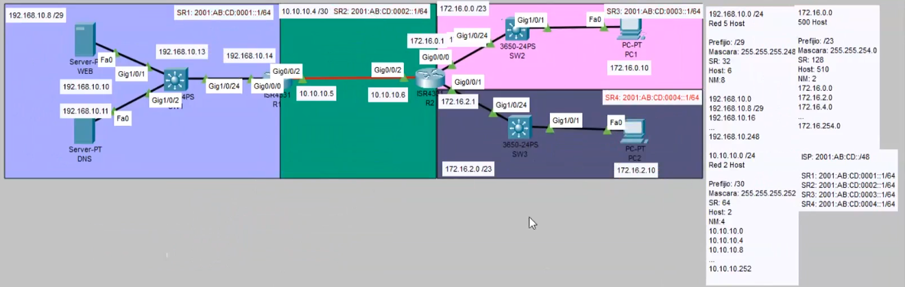
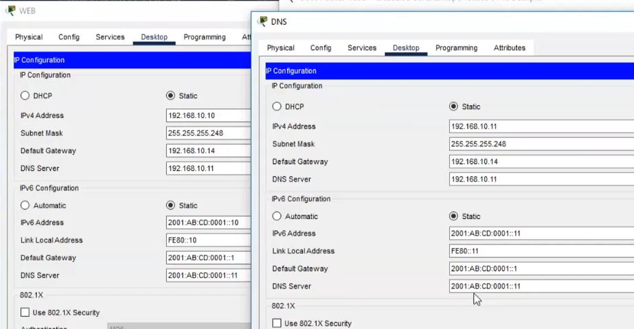
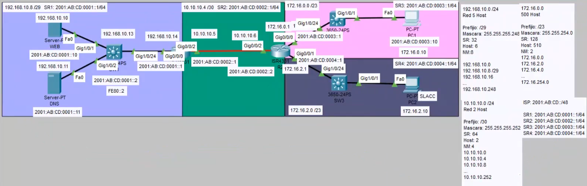

### Configuración Dual (IPv4-IPv6)

### Configurando IPv4
    !SW1
    enable
    configure terminal
    hostname SW1
    no ip domain-lookup
    interface vlan 1
    ip address 192.168.10.13 255.255.255.248
    no shutdown
    ip default-gateway 192.168.10.14
    exit
---
    !R1
    enable
    configure terminal
    hostname R1
    no ip domain-lookup
    interface g0/0/0
    ip address 192.168.10.14 255.255.255.248
    no shutdown
    interface g0/0/2
    ip address 10.10.10.5 255.255.255.252
    no shutdown
-----------
    !R2
    enable
    configure terminal
    hostname R2
    no ip domain-lookup
    interface g0/0/2
    ip address 10.10.10.6 255.255.255.252
    no shutdown
    interface g0/0/1
    ip address 172.16.2.1 255.255.254.0
    no shutdown
    interface g0/0/0
    ip address 172.16.0.1 255.255.254.0
    no shutdown
---
    #show running-configure
    #show in interface brief
    #show mac-addres-table
    #show ip arp
    #show interface g0/0/0
    #show ip interface g0/0/0
    #show ip route 
    #traceroute
    #ping
---
    PC

    #ipconfig
    #ping 
    #tracert
    #arp -a
    #netstat -r 
    #netstat 
---
    R1
    ip route 0.0.0.0 0.0.0.0 10.10.10.6

    R2
    ip route 0.0.0.0 0.0.0.0 10.10.10.5
---
### Configuración IPv6
    !SW1
    enable
    configure terminal
    ipv6 unicast-routing
    interface vlan 1
    ipv6 address 2001:AB:CD:0001::2/64
    ipv6 address FE80::2 link-local
    exit
    ipv6 route ::/0 2001:AB:CD:0001::1
---
    show running-configure
    show ipv6 interface brief
    show ipv6 interface g0/0/0
    show ipv6 route 
    show ipv6 neighbors
    ping 2001:AB:CD:0001::X
---
    !R1
    enable
    configure terminal
    ipv6 unicast-routing
    interface g0/0/0
    ipv6 address 2001:AB:CD:0001::1/64
    ipv6 address FE80::1 link-local
    no shutdown
    interface g0/0/2
    ipv6 address 2001:AB:CD:0002::1/64
    ipv6 address FE90::1 link-local
    no shutdown
    ipv6 route ::/0 2001:AB:CD:0002::2  -> R2
---
    !R2
    enable
    configure terminal
    ipv6 unicast-routing
    interface g0/0/2
    ipv6 address 2001:AB:CD:0002::2/64
    ipv6 address FE90::2 link-local
    no shutdown
    interface g0/0/1
    ipv6 address 2001:AB:CD:0004::1/64
    ipv6 address FE80::1 link-local
    no shutdown
    interface g0/0/0
    ipv6 address 2001:AB:CD:0003::1/64
    ipv6 address FE80::1 link-local
    no shut
    ipv6 route ::/0 2001:AB:CD:0002::1  -> R1
---
    #
    ping 2001:AB:CD:0002::X
    ping 2001:AB:CD:0003::X
    ping 2001:AB:CD:0004::X
    tracert 2001:AB:CD:0001::11
---

    R1
    ipv6 route ::/0 2001:AB:CD:0002::2  -> R2
---
    R2
    ipv6 route ::/0 2001:AB:CD:0002::1  -> R1
---
### Configuración SSH-> SW1-R1
    ! hostname SW1
    ip domain-name mundo-feliz.com
    crypto key generate rsa general-key modulus 2000
    username cisco privilege 15 secret cisco
    username edison secret edison
    enable secret cisco
    line vty 0 1
    login local
    exec-timeout 0 0
    transport input ssh
    exit
    banner motd ! TERRIBLES COSAS SUCEDEN A QUIENES INGRESEN SIN AUTORIZACIÓN!
    service password-encryption
    login block-for 30 attempts 2 within 20
    security passwords min-length 5
---
### Comprobando SSH
    PC
    ssh -l cisco 2001:AB:CD:0001::2
    terminal monitor