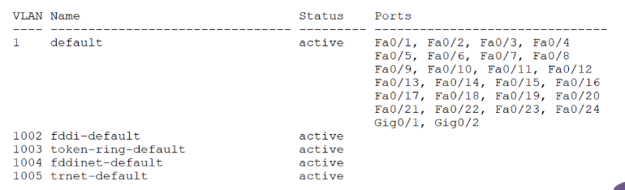
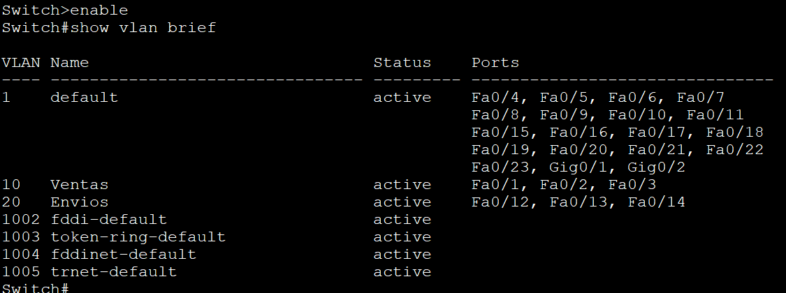
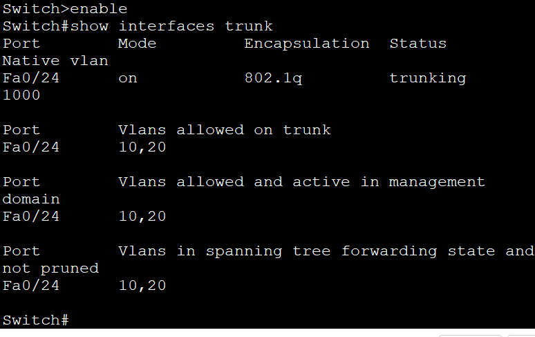

## Usaremos ya configuraciones realizadas, incorporando diferentes temáticas
### Configurcación de Vlan
Una LAN virtual (VLAN) es una agrupaci ́on l ́ogica de dispositivos de red
en el mismo dominio de difusi ́on que puede abarcar varios segmentos f ́ısicos.

#### Podemos conocer la configuraci ́on de VLAN de un conmutador mediante el siguiente comando.
Show vlan brief

Suponga que se desea segmentar una red de un almac ́en, en el cual se ha realizado una divisi ́on entre dos departamentos: **Ventas y Env ́ıos.** Se tienen
las siguientes caracter ́ısticas:
 * El ID de red disponible es: 192.168.1.0/24.
 * Se tiene disponible un solo switch con 24 puertos.
 * Cada departamento cuenta con 5 dispositivos.

 
| Dispositivo | Dirección IP | Subm ́ascara de red |Puerta de enlace| Interfaz del SW|
| --------- | -------- | --------- | -------- | --------- |
|PC0| 192.168.1.2 |255.255.255.0 |192.168.1.1 |FastEth 0/1|
|PC1 |192.168.1.3| 255.255.255.0| 192.168.1.1 |FastEth 0/2|
|PC2| 192.168.1.4 |255.255.255.0 |192.168.1.1 |FastEth 0/3|
|PC3| 192.168.1.5| 255.255.255.0 |192.168.1.1 |FastEth 0/4|
|PC4| 192.168.1.6| 255.255.255.0 |192.168.1.1 |FastEth 0/5|
|PC5| 192.168.1.7| 255.255.255.0 |192.168.1.1 |FastEth 0/12|
|PC6| 192.168.1.8| 255.255.255.0 |192.168.1.1 |FastEth 0/13|
|PC7 |192.168.1.9| 255.255.255.0 |192.168.1.1 |FastEth 0/14|
|PC8| 192.168.1.10| 255.255.255.0| 192.168.1.1 |FastEth 0/15|
|PC9 |192.168.1.11 |255.255.255.0 |192.168.1.1| FastEth 0/16|

    SW1
    vlan [n ́umero de VLAN]
    name [nombre de VLAN]

    Switch(config)#interface fastEthernet [n ́umero de puerto]
    Switch(config-if)#switchport mode access
    Switch(config-if)#switchport access vlan [n ́umero de vlan a asignar]
    Switch(config)#interface [interfaz a configurar]
    Switch(config-if)#switchport mode trunk
    Switch(config-if)#switchport trunk allowed vlan [vlan que transportar ́a]
    show interfaces trunk

