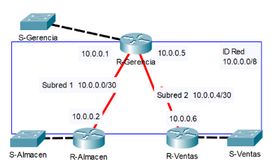

## Configuración de ACL | DHCP | EIGRP | VLAN
Se requiere que en cada edificio se implementen las siguientes VLAN:
* Gerencia. VLAN 100
* Almacen. VLAN 200
* Ventas. VLAN 300

Además las PC’s deber+an configurar su dirección IP mediante DHCP.

            Tabla de direccionamiento
 
|Dispositivo| Direcci ́on IP| Subm ́ascara de red |Interfaz|
|-----------|--------------|--------------------|--------|
|R-Gerencia |10.0.0.1| 255.255.255.252 |Serial 0/0/0*|
|R-Gerencia|10.0.0.5 |255.255.255.252 |Serial 0/0/1*|
|R-Almacen |10.0.0.2| 255.255.255.252 |Serial 0/0/0|
|R- Ventas |10.0.0.6| 255.255.255.252 |Serial 0/0/0|

    GERENCIA
    enable
    configure terminal
    vlan 100
    name Gerencia
    exit
    vlan 200
    name Almacen
    exit
    vlan 300
    name Ventas
    exit
    /////
    configure terminal
    interface fastEthernet 0/1
    switchport access vlan 100
    exit
    interface fastEthernet 0/2
    switchport access vlan 200
    exit
    interface fastEthernet 0/3
    switchport access vlan 300
    exit
    interface fastEthernet 0/24
    switchport mode trunk 
    switchport trunk allowed vlan 100,200,300
-----------------------------------------
    ALAMCEN
    enable
    configure terminal
    vlan 100
    name Gerencia
    exit
    vlan 200
    name Almacen
    exit
    vlan 300
    name Ventas
    exit
    interface fastEthernet 0/1
    switchport access vlan 100
    exit
    interface fastEthernet 0/2
    switchport access vlan 200
    exit
    interface fastEthernet 0/3
    switchport access vlan 300
    exit
    interface fastEthernet 0/24
    switchport mode trunk 
    switchport trunk allowed vlan 100,200,300
-----------------------------

    VENTAS
    configure terminal
    vlan 100
    name Gerencia
    exit
    vlan 200
    name Almacen
    exit
    vlan 300
    name Ventas
    ///////
    configure terminal
    interface fastEthernet 0/1
    switchport access vlan 100
    exit
    interface fastEthernet 0/2
    switchport access vlan 200
    exit
    interface fastEthernet 0/3
    switchport access vlan 300
    exit
    interface fastEthernet 0/24
    switchport mode trunk 
    switchport trunk allowed vlan 100,200,300
--------------------------------------------
    R-Gerencia
    enable 
    configure terminal
    hostname R-Gerencia
    interface gigabitEthernet 0/0.100
    description subinterfaz para VLAN 100
    encapsulation dot1Q 100
    ip address 192.168.1.1 255.255.255.0
    exit
    interface gigabitEthernet 0/0.200
    description subinterfaz para VLAN 200
    encapsulation dot1Q 200
    ip address 192.168.2.1 255.255.255.0
    exit
    interface gigabitEthernet 0/0.300
    description subinterfaz para VLAN 300
    encapsulation dot1Q 300
    ip address 192.168.3.1 255.255.255.0
    exit
    do copy running-config startup-config
    ////
    configure terminal
    ip dhcp pool vlan100
    network 192.168.1.0 255.255.255.0
    default-router 192.168.1.1
    exit
    ip dhcp pool vlan200
    network 192.168.2.0 255.255.255.0
    default-router 192.168.2.1
    exit
    ip dhcp pool vlan300
    network 192.168.3.0 255.255.255.0
    default-router 192.168.3.1
    exit
    ip dhcp excluded-address 192.168.1.1 192.168.1.10
    ip dhcp excluded-address 192.168.2.1 192.168.2.10
    ip dhcp excluded-address 192.168.3.1 192.168.3.10
---
#### Enrutameinto
    ////
    router eigrp 1
    network 192.168.1.0 255.255.255.0
    network 192.168.2.0
    network 192.168.3.0
    network 10.0.0.0 255.255.255.252
    network 10.0.0.4 255.255.255.252
    /////
#### Listas ACL
Una forma de restringir el tr ́afico de la red entre VLAN es mediante el uso de Listas de Control de Acceso (ACL).
Una lista de control de acceso est ́a compuesta por una serie de sentencias secuenciales configuradas en el router, creando as ́ı, para una misma ACL, diferentes filtros listados en el mismo orden en que han sido configurados.

Analicemos el caso para la PC0 que pertenece a la VLAN 100.
En este caso se desea que haya comunicaci ́on entre las PC3 (192.168.4.0/24)
y PC6 (192.168.7.0), pertenecientes a la misma VLAN.
Creamos la ACL 1 en el R-Gerencia.

    access-list 1 permit 192.168.4.0 0.0.0.255
    access-list 1 permit 192.168.7.0 0.0.0.255
    access-list 1 deny any

Y asignamos a la interfaz Gigabit 0/0.100

    interface gigabitEthernet 0/0.100
    ip access-group 1 out
    exit
Podemos hacer lo mismo para la PC1 que pertenece a la VLAN 200.
En este caso se desea que haya comunicaci ́on entre las PC4 (192.168.5.0/24)
y PC7 (192.168.8.0), pertenecientes a la misma VLAN.
Creamos la ACL 2 en el R-Gerencia.

    access-list 2 permit 192.168.5.0 0.0.0.255
    access-list 2 permit 192.168.8.0 0.0.0.255
    access-list 2 deny any

Y asignamos a la interfaz Gigabit 0/0.200

    interface gigabitEthernet 0/0.200
    ip access-group 2 out
    exit

Podemos hacer lo mismo para la PC2 que pertenece a la VLAN 300.
En este caso se desea que haya comunicaci ́on entre las PC5 (192.168.6.0/24)
y PC8 (192.168.9.0), pertenecientes a la misma VLAN.
Creamos la ACL 3 en el R-Gerencia.

    access-list 3 permit 192.168.6.0 0.0.0.255
    access-list 3 permit 192.168.9.0 0.0.0.255
    access-list 3 deny any

Y asignamos a la interfaz Gigabit 0/0.300

    interface gigabitEthernet 0/0.300
    ip access-group 3 out
    exit
-----------------------------------------------
    R-Almacen
    enable 
    configure terminal
    hostname R-Almacen
    interface gigabitEthernet 0/0
    no shutdown
    interface gigabitEthernet 0/0.100
    description subinterfaz para VLAN 100
    encapsulation dot1Q 100
    ip address 192.168.4.1 255.255.255.0
    exit
    interface gigabitEthernet 0/0.200
    description subinterfaz para VLAN 200
    encapsulation dot1Q 200
    ip address 192.168.5.1 255.255.255.0
    exit
    interface gigabitEthernet 0/0.300
    description subinterfaz para VLAN 300
    encapsulation dot1Q 300
    ip address 192.168.6.1 255.255.255.0
    exit
    do copy running-config startup-config
    ////
    configure terminal
    ip dhcp pool vlan100
    network 192.168.4.0 255.255.255.0
    default-router 192.168.4.1
    exit
    ip dhcp pool vlan200
    network 192.168.5.0 255.255.255.0
    default-router 192.168.5.1
    exit
    ip dhcp pool vlan300
    network 192.168.6.0 255.255.255.0
    default-router 192.168.6.1
    exit
    ip dhcp excluded-address 192.168.4.1 192.168.4.10
    ip dhcp excluded-address 192.168.5.1 192.168.5.10
    ip dhcp excluded-address 192.168.6.1 192.168.6.10
    /////
---
#### Enrutamiento
    router eigrp 1
    network 192.168.6.0 255.255.255.0
    network 192.168.4.0
    network 192.168.5.0
    network 10.0.0.0 255.255.255.252
    /////
---
#### Listas ACL
    access-list 1 permit 192.168.1.0 0.0.0.255
    access-list 1 permit 192.168.7.0 0.0.0.255
    access-list 1 deny any
    interface gigabitEthernet 0/0.100
    ip access-group 1 out
    exit
    access-list 2 permit 192.168.2.0 0.0.0.255
    access-list 2 permit 192.168.8.0 0.0.0.255
    access-list 2 deny any
    interface gigabitEthernet 0/0.200
    ip access-group 2 out
    exit
    access-list 3 permit 192.168.3.0 0.0.0.255
    access-list 3 permit 192.168.9.0 0.0.0.255
    access-list 3 deny any
    interface gigabitEthernet 0/0.300
    ip access-group 3 out
    exit
----------------------------------------------------
    R-Ventas #ver la g0/0 si esta encendido
    enable 
    configure terminal
    hostname R-Ventas
    interface gigabitEthernet 0/0.100
    description subinterfaz para VLAN 100
    encapsulation dot1Q 100
    ip address 192.168.7.1 255.255.255.0
    exit
    interface gigabitEthernet 0/0.200
    description subinterfaz para VLAN 200
    encapsulation dot1Q 200
    ip address 192.168.8.1 255.255.255.0
    exit
    interface gigabitEthernet 0/0.300
    description subinterfaz para VLAN 300
    encapsulation dot1Q 300
    ip address 192.168.9.1 255.255.255.0
    exit
    do copy running-config startup-config
    ////
    configure terminal
    ip dhcp pool vlan100
    network 192.168.7.0 255.255.255.0
    default-router 192.168.7.1
    exit
    ip dhcp pool vlan200
    network 192.168.8.0 255.255.255.0
    default-router 192.168.8.1
    exit
    ip dhcp pool vlan300
    network 192.168.9.0 255.255.255.0
    default-router 192.168.9.1
    exit
    ip dhcp excluded-address 192.168.7.1 192.168.7.10
    ip dhcp excluded-address 192.168.8.1 192.168.8.10
    ip dhcp excluded-address 192.168.9.1 192.168.9.10
    ////
---
#### Enrutameinto EIGRP
    router eigrp 1
    network 192.168.9.0 255.255.255.0
    network 192.168.7.0
    network 192.168.8.0
    network 10.0.0.4 255.255.255.252
    /////
---
#### Listas ACL
    access-list 1 permit 192.168.1.0 0.0.0.255
    access-list 1 permit 192.168.4.0 0.0.0.255
    access-list 1 deny any
    interface gigabitEthernet 0/0.100
    ip access-group 1 out
    exit
    access-list 2 permit 192.168.2.0 0.0.0.255
    access-list 2 permit 192.168.5.0 0.0.0.255
    access-list 2 deny any
    interface gigabitEthernet 0/0.200
    ip access-group 2 out
    exit
    access-list 3 permit 192.168.3.0 0.0.0.255
    access-list 3 permit 192.168.6.0 0.0.0.255
    access-list 3 deny any
    interface gigabitEthernet 0/0.300
    ip access-group 3 out
    exit