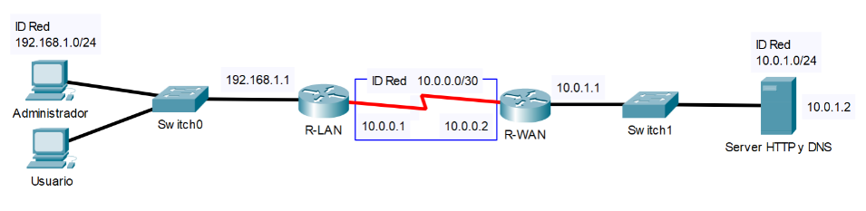
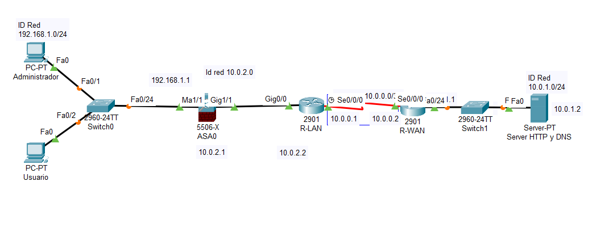

## Configuración de Firewall
Un **firewall** es una pieza de software o hardware que filtra todo el tr ́afico de
red entre su computadora, red dom ́estica o red de la empresa e Internet.
Las funciones principales de un firewall son:
* Conservaci ́on de la direcci ́on IP y reenv ́ıo de tr ́afico.
* Diferenciaci ́on de la red.
* Protecci ́on contra ataques DoS, escaneo y rastreo.
* Filtrado de puertos e IP.
* Redirecci ́on de paquetes
* Autenticaci ́on y cifrado mejorados
* Registro complementado

Se parte de la siguiente configuración

Tabla de direcciones

|Dispositivo |Direcci ́on IP |Subm ́ascara de red| Puerta de enlace| Interfaz|
|-------------|-------------------|---------------------|------------------|--------|
|R-LAN|10.0.0.1| 255.255.255.252 |N/A| Serial 0/0/0*|
|R-LAN|192.168.1.1 |255.255.255.0 |N/A |Gigabit 0/0|
|R-WAN |10.0.0.2 |255.255.255.252 |N/A| Serial 0/0/0|
|R-WAN|10.0.1.1 |255.255.255.0 |N/A| Gigabit 0/0|
|Servidor HTTP y DNS |10.0.1.2 |255.255.255.0 |10.0.1.1 |Fast 0/0|
|Administrador| 192.168.1.2| 255.255.255.0| 192.168.1.1 |Fast 0/0|
|Usuario| 192.168.1.3| 255.255.255.0 |192.168.1.1 |Fast 0/0|

Ahora:
* Conectamos un firewall ASA 5506-X en la Red LAN
* Designamos la red LAN 10.0.2.0/30 para la conexi ́on entre el Router y el Firewall.
* Asignamos las interfaces del firewall
    - INSIDE (192.168.1.1). Se conecta a la interface Management 1/1
    - OUTSIDE (10.0.2.1). Se conecta a la interface Gigabit 1/1

    #ROUTER LAN
    enable
    configure terminal
    interface g0/0
    no ip helper-address 10.0.1.4
    ip address 10.0.2.2 255.255.255.0
    no shutdown
    interface s0/0/0
    ip route 0.0.0.0 0.0.0.0 10.0.2.1
    do show ip route
----------------------------------
    #Firewall
    enable
    configure factory-default
    configure terminal
    interface g1/1
    nameif outside
    security-level 0
    ip address 10.0.2.1 255.255.255.252
    no shutdown
    exit
    interface management 1/1
    nameif inside100
    security-level 100
    no shutdown
    ip address 192.168.1.1 255.255.255.0
    no shutdown
---
    dhcpd address 192.168.1.100-192.168.1.200 inside100
    dhcpd enable inside100
    dhcpd option 3 ip 192.168.1.1
    dhcpd dns 10.0.1.2
    route outside 0.0.0.0 0.0.0.0 10.0.2.2
---
    class-map inspeccion
    match default-inspection-traffic
    exit
    policy-map global_pol
    class inspeccion
    inspect icmp
    inspect http
    exit
    no service-policy global_policy global
    no policy-map globla_policy
    no class-map inspection_deafault
    no policy-map type inspect dns present_dns_map
    service-policy global_pol global
---
    policy-map type inspect dns map_dns
    parameters
    message-length maximum 512
    exit
    exit
    policy-map global_pol
    class inspeccion
    inspect dns map_dns