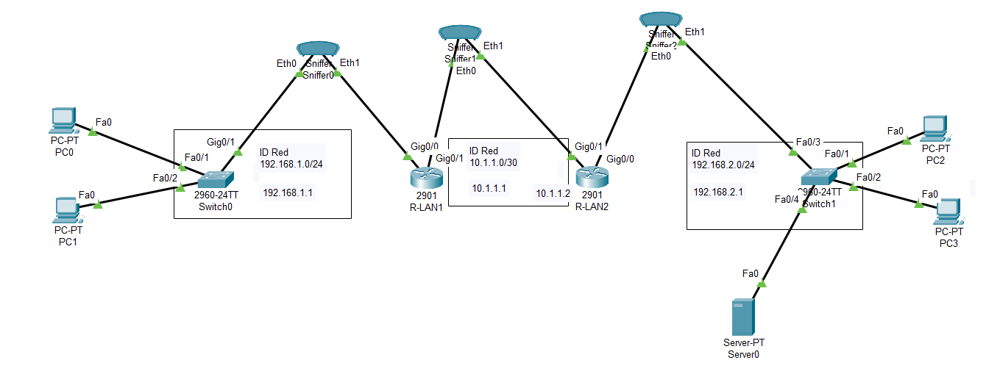
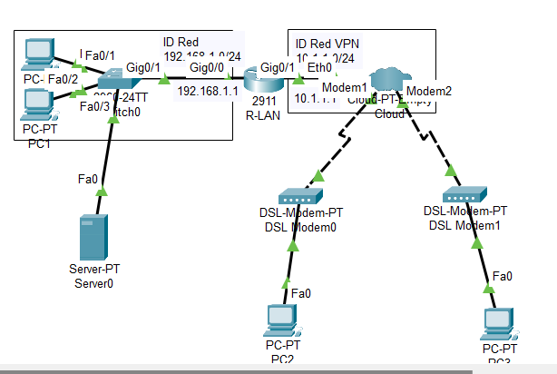

## Configuración de IPSEC | VPN
Una Red Privada Virtual VPN (Virtual Private Network): es la tecnolog ́ıa que habilita el transporte de datos de manera segura entre dispositivos de una red privada a trav ́es de un medio p ́ublico como Internet.

IPSec

VPN

#### Configuración de VPN
    #R-LAN
    aaa new-model
    aaa authentication login USUARIOVPN group tacacs
    aaa authorization network VPNC group tacacs+
    line vty 0 15
    password academia
    login authentication USUARIOVPN
    crypto isakmp policy 10
    encryption aes 256
    authentication pre-share
    group 5
    lifetime 3600
    exit
    crypto isakmp client configuration group VPNC
    key academia
    pool POOLVPN
    crypto ipsec transform-set SETVPN esp-aes esp-sha-hmac
    crypto dynamic-map VPNDINAMICA 10
    set transform-set SETVPN
    reverse-route
    exit
    crypto map STATICMAP client authentication list USAURIOVPN
    crypto map STATICMAP isakmp authorization list VPNC
    crypto map STATICMAP client configuration address respond
    crypto map STATICMAP 10 ipsec-isakmp dynamic VPNDINAMICA
    int g0/1
    crypto map STATICMAP
    exit
    ip local pool POOLVPN 192.168.1.200
    tacacs-server host 192.168.1.2
    tacacs-server key 123456789
    ip dhcp pool POOLVPN2
    network 10.1.1.0 255.255.255.0
    default-router 10.1.1.1
    ip dhcp excluded-address 10.1.1.1
#### Configuración de IPSEC
    #R-LAN1
    crypto isakmp policy 5
    hash sha
    authentication pre-share
    group 2
    lifetime 86400
    encryption 3des
    exit
    crypto isakmp key academia address 10.1.1.2
    crypto ipsec transform-set MI-TRANFORM esp-aes 128 esp-md5-hmac
    crypto ipsec security-association lifetime seconds 3600
    ip access-list extended TRAFICO-VPN
    permit ip 192.168.1.0 0.0.0.255 192.168.2.0 0.0.0.255
    exit
    crypto map IPSEC-VPN 10 ipsec-isakmp
    match address TRAFICO-VPN
    set peer 10.1.1.2
    set transform-set MI-TRANFORM
    exit
    interface g0/1
    crypto map IPSEC-VPN
    exit
    ip access-list extended 101
    deny ip 192.168.1.0 0.0.0.255 192.168.2.0 0.0.0.255
    permit ip 192.168.1.0 0.0.0.255 any
    exit
    ip nat inside source list 101 interface g0/1 overload
    do show crypto ipsec
    do show crypto isakmp sa
-------------------------------------------------
    #R-LAN
    crypto isakmp policy 5
    hash sha
    authentication pre-share
    group 2
    lifetime 86400
    encryption 3des
    exit
    crypto isakmp key academia address 10.1.1.1
    crypto ipsec transform-set MI-TRANFORM esp-aes 128 esp-md5-hmac
    crypto ipsec security-association lifetime seconds 3600
    ip access-list extended TRAFICO-VPN
    permit ip 192.168.2.0 0.0.0.255 192.168.1.0 0.0.0.255
    exit
    crypto map IPSEC-VPN 10 ipsec-isakmp
    match address TRAFICO-VPN
    set peer 10.1.1.1
    set transform-set MI-TRANFORM
    exit
    interface g0/1
    crypto map IPSEC-VPN
    exit
    ip access-list extended 101
    deny ip 192.168.1.0 0.0.0.255 192.168.2.0 0.0.0.255
    permit ip 192.168.1.0 0.0.0.255 any
    exit
    ip nat inside source list 101 interface g0/1 overload