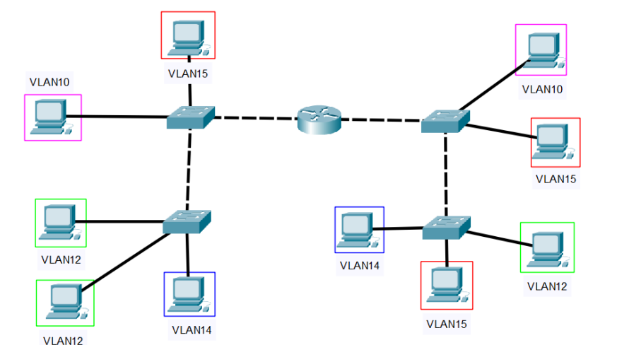
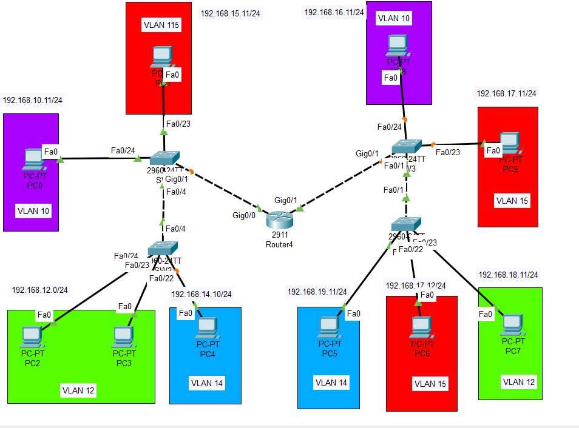

## Prueba de Conocimientos
Se desea diseñar una red local con la siguiente topología

Obtener:
* a. Proponga los identificadores de red de clase C necesarios para las redes locales 
* b. Configure para cada switch: 
    *  i. VLAN 
    *   ii. Enlaces de acceso  
    * iii. Enlaces troncales. Para los enlaces troncales, solo deben transportar 
* información de las VLAN necesarias 
* c. Configuración del Router 
    * i. Interfaces y subinterfaces 
    * ii. Listas de acceso 
#### Configuración de Switches
    #SW1
    enable
    conf t
    hostname SW1
    vlan 10
    name VLAN10
    exit
    vlan 15
    name VLAN15
    exit
    vlan 12
    name VLAN12
    exit
    vlan 14
    name VLAN14
    exit
    interface f0/24
    switchport mode access
    switchport access vlan 10
    exit
    int f0/23
    switchport mode access
    switchport access vlan 15
    exit
    int g0/1
    switchport mode trunk
    switchport trunk allowed vlan 10-15
    exit
    int f0/4
    switchport mode trunk
    exit
    interface range f0/1 - 24
    spanning-tree portfast
    spanning-tree mode rapid-pvst
    do copy running-config startup-config
----------------------------------------------
    #SW2
    enable
    conf t
    hostname SW2
    vlan 12
    name VLAN12
    exit
    vlan 14
    name VLAN14
    exit
    vlan 10
    name VLAN15
    exit
    vlan 15
    name VLAN15
    exit
    interface range f0/23 - 24
    switchport mode access
    switchport access vlan 12
    exit
    int f0/22
    switchport mode access
    switchport access vlan 14
    exit
    int f0/4
    switchport mode trunk
    exit
    interface range f0/1 - 24
    spanning-tree portfast
    spanning-tree mode rapid-pvst
    do copy running-config startup-config
-------------------------------------------------
    #SW3
    enable
    conf t
    vlan 10
    name VLAN10
    exit
    vlan 15
    name VLAN15
    exit
    vlan 14
    name VLAN14
    exit
    vlan 12
    name VLAN12
    exit
    int f0/24
    switchport mode access
    switchport access vlan 10
    exit
    int f0/23
    switchport mode access
    switchport access vlan 15
    exit
    int g0/1
    switchport mode trunk
    switchport trunk allowed vlan 10-15
    exit
    int f0/1
    switchport mode trunk
    exit
    interface range f0/1 - 24
    spanning-tree portfast
    spanning-tree mode rapid-pvst
    do copy running-config startup-config
---------------------------------------------------
    #SW4
    enable
    conf t
    hostname SW4
    vlan 12
    name VLAN12
    exit
    vlan 14
    name VLAN14
    exit
    vlan 15
    name VLAN15
    exit
    vlan 10
    name VLAN10
    exit
    int f0/22
    switchport mode access
    switchport access vlan 12
    exit
    int f0/23
    switchport mode access
    switchport access vlan 15
    exit
    int f0/24
    switchport mode access
    switchport access vlan 14
    exit
    int f0/1
    siwtchport mode trunk
    exit
    interface range f0/1 - 24
    spanning-tree portfast
    spanning-tree mode rapid-pvst
    do copy running-config startup-config
---------------------------------------------------------
#### COnfiguración del Router
    #R1
    enable
    conf t
    hostname R1
    ////////////Subinterfaces g0/0////////////////////////
    int g0/0
    no shutdown
    int g0/0.10
    encapsulation dot1Q 10
    ip address 192.168.10.1 255.255.255.0
    no shutdown
    exit
    int g0/0.15
    encapsulation dot1Q 15
    ip address 192.168.15.1 255.255.255.0
    no shutdown
    exit
    int g0/0.12
    encapsulation dot1Q 12
    ip address 192.168.12.1 255.255.255.0
    no shutdown
    exit
    int g0/0.14
    encapsulation dot1Q 14
    ip address 192.168.14.1 255.255.255.0
    no shutdown
    exit
    ////////////Subinterfaces g0/1////////////////////////
    int g0/1
    no shutdown
    int g0/1.10
    encapsulation dot1Q 10
    ip address 192.168.16.1 255.255.255.0
    no shutdown
    exit
    int g0/1.15
    encapsulation dot1Q 15
    ip address 192.168.17.1 255.255.255.0
    no shutdown
    exit
    int g0/1.12
    encapsulation dot1Q 12
    ip address 192.168.18.1 255.255.255.0
    no shutdown
    exit
    int g0/1.14
    encapsulation dot1Q 14
    ip address 192.168.19.1 255.255.255.0
    no shutdown
    exit
  ##### DHCP////////////////////////
    ip dhcp pool vlan0-10
    network 192.168.10.0 255.255.255.0
    default-router 192.168.10.1
    ip dhcp excluded-address 192.168.10.1 192.168.10.10
    ip dhcp pool vlan0-12
    network 192.168.12.0 255.255.255.0
    default-router 192.168.12.1
    ip dhcp excluded-address 192.168.12.1 192.168.12.10
    ip dhcp pool vlan0-14
    network 192.168.14.0 255.255.255.0
    default-router 192.168.14.1
    ip dhcp excluded-address 192.168.14.1 192.168.14.10
    ip dhcp pool vlan0-15
    network 192.168.15.0 255.255.255.0
    default-router 192.168.15.1
    ip dhcp excluded-address 192.168.15.1 192.168.15.10
    ip dhcp pool vlan0-16
    network 192.168.16.0 255.255.255.0
    default-router 192.168.16.1
    ip dhcp excluded-address 192.168.16.1 192.168.16.10
    ip dhcp pool vlan0-18
    network 192.168.18.0 255.255.255.0
    default-router 192.168.18.1
    ip dhcp excluded-address 192.168.18.1 192.168.18.10
    ip dhcp pool vlan0-19
    network 192.168.19.0 255.255.255.0
    default-router 192.168.19.1
    ip dhcp excluded-address 192.168.19.1 192.168.19.10
    ip dhcp pool vlan0-17
    network 192.168.17.0 255.255.255.0
    default-router 192.168.17.1
    ip dhcp excluded-address 192.168.17.1 192.168.17.10
##### Ruteo Dináminco con OSPF////////////////////////
    router ospf 1
    router-id 1.1.1.2
    passive-interface GigabitEthernet0/0
    passive-interface GigabitEthernet0/1
    passive-interface GigabitEthernet0/0.10
    passive-interface g0/0.12
    passive-interface g0/0.14
    passive-interface g0/0.15
    passive-interface GigabitEthernet0/1.10
    passive-interface g0/1.12
    passive-interface g0/1.14
    passive-interface g0/1.15
    network 192.168.10.0 0.0.0.255 area 0
    network 192.168.16.0 0.0.0.255 area 0
    network 192.168.12.0 255.255.255.0 area 0
    network 192.168.14.0 255.255.255.0 area 0
    network 192.168.15.0 255.255.255.0 area 0
    network 192.168.18.0 255.255.255.0 area 0
    network 192.168.17.0 255.255.255.0 area 0
    network 192.168.19.0 255.255.255.0 area 0
    exit
##### Aplicando ACLs////////////////////////
    access-list 101 permit ip 192.168.10.0 0.0.0.255 192.168.16.0 0.0.0.255
    access-list 101 permit ip 192.168.12.0 0.0.0.255 192.168.18.0 0.0.0.255
    access-list 101 permit ip 192.168.14.0 0.0.0.255 192.168.19.0 0.0.0.255
    access-list 101 permit ip 192.168.15.0 0.0.0.255 192.168.17.0 0.0.0.255
    access-list 101 deny ip 192.168.10.0 0.0.0.255 192.168.18.0 0.0.0.255
    access-list 101 deny ip 192.168.10.0 0.0.0.255 192.168.19.0 0.0.0.255
    access-list 101 deny ip 192.168.10.0 0.0.0.255 192.168.17.0 0.0.0.255
    access-list 101 deny ip 192.168.12.0 0.0.0.255 192.168.16.0 0.0.0.255
    access-list 101 deny ip 192.168.12.0 0.0.0.255 192.168.19.0 0.0.0.255
    access-list 101 deny ip 192.168.12.0 0.0.0.255 192.168.17.0 0.0.0.255
    access-list 101 deny ip 192.168.14.0 0.0.0.255 192.168.16.0 0.0.0.255
    access-list 101 deny ip 192.168.14.0 0.0.0.255 192.168.18.0 0.0.0.255
    access-list 101 deny ip 192.168.14.0 0.0.0.255 192.168.17.0 0.0.0.255
    access-list 101 deny ip 192.168.15.0 0.0.0.255 192.168.16.0 0.0.0.255
    access-list 101 deny ip 192.168.15.0 0.0.0.255 192.168.18.0 0.0.0.255
    access-list 101 deny ip 192.168.15.0 0.0.0.255 192.168.19.0 0.0.0.255
    access-list 101 permit ip any any
    int g0/0.10
    ip access-group 101 in
    exit
    int g0/0.12
    ip access-group 101 in
    exit
    int g0/0.15
    ip access-group 101 in
    exit
    int g0/0.14
    ip access-group 101 in
    exit
    int g0/1.10
    ip access-group 101 in
    exit
    int g0/1.12
    ip access-group 101 in
    exit
    int g0/1.15
    ip access-group 101 in
    exit
    int g0/1.14
    ip access-group 101 in
    exit
    do copy running-config startup-config
----------------------------------------------------------------------
## Solución

