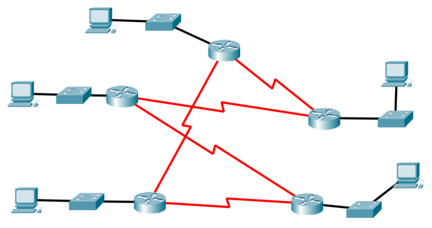
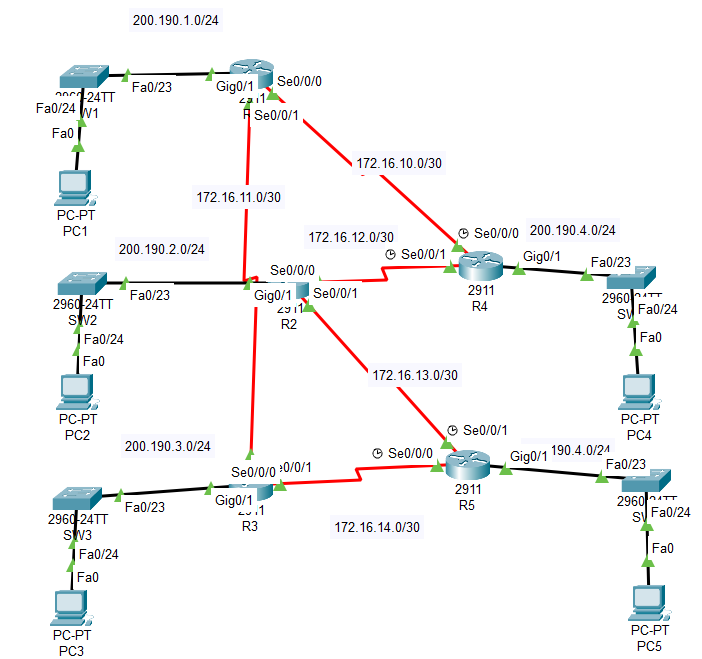

## Prueba de Conocimientos
Se desea construir la siguiente topología: 

Obtener:
* a. La implementación en Cisco Packet Tracer. 
* b. Para la conexión entre los routers utilice identificadores de clase B con subneteo para dos dispositivos. 
* c. Para las redes locales utilice identificadores clase C 
* d. Debe implementar una técnica de ruteo dinámica (puede elegir la de su preferencia). 
#### Configuración de SWITCHS
    enable
    conf t
    hostname SW5
    interface range f0/1 - 24
    spanning-tree portfast
    spanning-tree mode rapid-pvst
    do copy running-config startup-config
    int f0/23
    switchport mode trunk
    switchport trunk allowed vlan 1-100
    do wr
-------------------------------------------------------
#### Configuración de Ruoters
    #R1
    enable
    conf t
    hostname R1
    int g0/1
    ip add 200.190.1.1 255.255.255.0
    no shut
    ip dhcp pool sw1
    network 200.190.1.0 255.255.255.0
    default-router 200.190.1.1
    ip dhcp excluded-address 200.190.1.1 200.190.1.10
    int s0/0/0
    ip add 172.16.10.1 255.255.255.252
    no shut
    int s0/0/1
    ip add 172.16.11.1 255.255.255.252
    no shut
    ip routing
    router ospf 1
    router-id 1.1.1.1
    passive-interface g0/0
    network 172.16.10.0 255.255.255.252 area 0
    network 172.16.11.0 255.255.255.252 area 0
    network 200.190.1.0 255.255.255.0 area 0
-------------------------------------------------------------
    #R2
    enable
    conf t
    hostname R2
    int g0/1
    ip add 200.190.2.1 255.255.255.0
    no shut
    ip dhcp pool sw2
    network 200.190.2.0 255.255.255.0
    default-router 200.190.2.1
    ip dhcp excluded-address 200.190.2.1 200.190.2.10
    int s0/0/0
    ip add 172.16.12.1 255.255.255.252
    no shut
    int s0/0/1
    ip add 172.16.13.1 255.255.255.252
    no shut
    ip routing
    router ospf 1
    router-id 1.1.2.2
    passive-interface g0/0
    network 172.16.12.0 255.255.255.252 area 0
    network 172.16.13.0 255.255.255.252 area 0
    network 200.190.2.0 255.255.255.0 area 0
    do wr
-----------------------------------------------------------------
    #R3
    enable
    conf t
    hostname R3
    int g0/1
    ip add 200.190.3.1 255.255.255.0
    no shut
    ip dhcp pool sw3
    network 200.190.3.0 255.255.255.0
    default-router 200.190.3.1
    ip dhcp excluded-address 200.190.3.1 200.190.3.10
    int s0/0/1
    ip add 172.16.11.2 255.255.255.252
    no shut
    int s0/0/0
    ip add 172.16.14.1 255.255.255.252
    no shut
    ip routing
    router ospf 1
    router-id 1.1.3.3
    passive-interface g0/0
    network 172.16.11.0 255.255.255.252 area 0
    network 172.16.14.0 255.255.255.252 area 0
    network 200.190.3.0 255.255.255.0 area 0
------------------------------------------------------------------
    #R4
    enable
    conf t
    hostname R4
    int g0/1
    ip add 200.190.4.1 255.255.255.0
    no shut
    ip dhcp pool sw4
    network 200.190.4.0 255.255.255.0
    default-router 200.190.4.1
    ip dhcp excluded-address 200.190.4.1 200.190.4.10
    int s0/0/0
    ip add 172.16.10.2 255.255.255.252
    no shut
    int s0/0/1
    ip add 172.16.12.2 255.255.255.252
    no shut
    ip routing
    router ospf 1
    router-id 1.1.4.4
    passive-interface g0/0
    network 172.16.10.0 255.255.255.252 area 0
    network 172.16.12.0 255.255.255.252 area 0
    network 200.190.4.0 255.255.255.0 area 0
------------------------------------------------------------
    #R5
    enable
    conf t
    hostname R5
    int g0/1
    ip add 200.190.5.1 255.255.255.0
    no shut
    ip dhcp pool sw5
    network 200.190.5.0 255.255.255.0
    default-router 200.190.5.1
    ip dhcp excluded-address 200.190.5.1 200.190.5.10
    int s0/0/1
    ip add 172.16.13.2 255.255.255.252
    no shut
    int s0/0/0
    ip add 172.16.14.2 255.255.255.252
    no shut
    ip routing 
    router ospf 1
    router-id 1.1.5.5
    passive-interface g0/0
    network 172.16.13.0 255.255.255.252 area 0
    network 172.16.14.0 255.255.255.252 area 0
    network 200.190.5.0 255.255.255.0 area 0
---
## Solución
