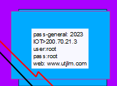
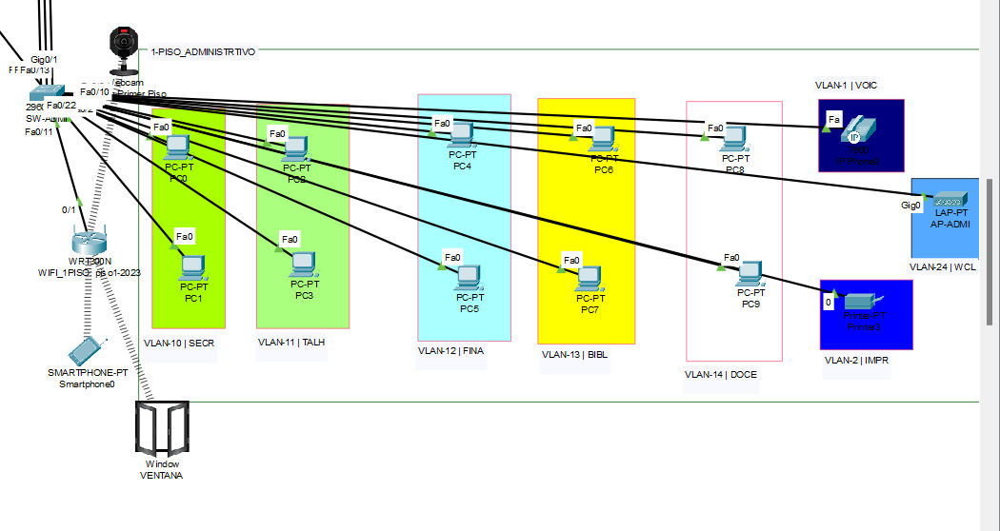

## Laboratorio a Trabajar
### Sede Ambato-Matriz
Toda las direcciones IPv4 | MAC  | IPv6 | Routers | Switchs | se localizan en un excel llamado : FNP_Análisis_Proyecto

#### Vlans 

#### Constraseña

##### Primer Piso Administrativo

##### Segundo Piso Autoridades

##### Tercer Piso Informática

##### Cuarto Piso Comunidad

###### Facultad de Ingeniería

###### Facultad de Ciencias de la Educación

###### Facultad de Economía y Negocios

###### Facultad de Salud

### Sede Puyo y Tena

### Sede Latacunga y Alausi

