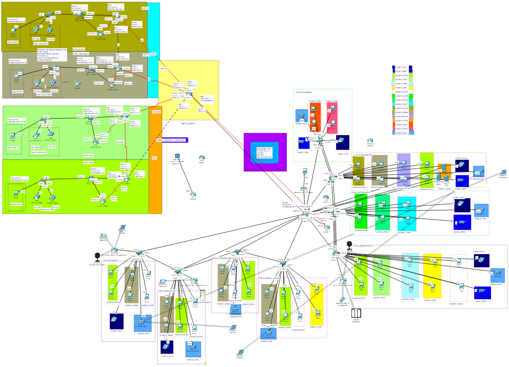

# Infraestructura_Redes
Contiene conceptos básicos y generales. 
Varios proyectos de prática y uno que es relacionado al Entorno Real

# Meta alcanzar
Fundamentar los conceptos básicos de redes, modelos de comunicación mediante el análisis de capas, así como mostrar la importancia y las aplicaciones de las redes de datos convergentes en el ámbito empresarial enfocadas a la arquitectura mediante los modelos de referencia OSI y TCP/IP.

## Contenido del proyecto al entorno real (Carpeta:  Prácticas 3)
* Redes de computadores 
* Modelo OSI 
* Modelo TCP/IP 
* Encapsulación y desencapsulación 
* Protocolos y estándares capa aplicación 
* Protocolos y estándares capa transporte 
* Protocolos y estándares capa internet 
* Protocolos y estándares capa acceso a red. 
* Capacidad del canal de comunicación 
* Medios de transmisión de datos  
* Medios guiados y medios no guiados 
* Medio inalámbrico 

### Para ver más detallada la Imagen, ve a la carpeta **P3.02_Laboratorio**
## Otros laboratorios
Configuración Dual (IPv4-IPv6)

Configuración VPN

